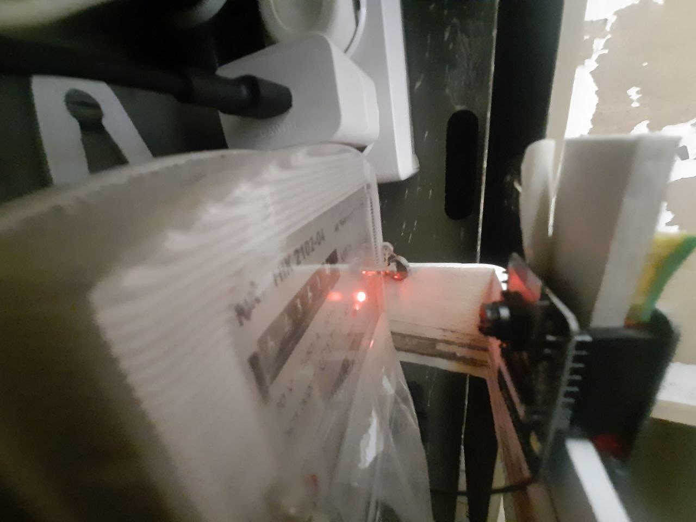

# ESP32-CAM MQTT monitoring

Camera-oriented ESPHome configuration for meter monitoring and MQTT
integration.

## Configuration

| File | Board | Interfaces |
|---|---|---|
| `esp32cam_meter_mqtt_work.yaml` | ESP32 DevKit configuration | I2C GPIO26/GPIO27, Wi-Fi, MQTT, API and web server |

## Pinout for `esp32cam_meter_mqtt_work.yaml`

The configuration uses an ESP32 camera module plus an I2C meter sensor:

| Function | GPIO | Notes |
|---|---:|---|
| Camera external clock | GPIO0 | 20 MHz XCLK |
| Camera I2C SDA | GPIO26 | Camera control bus |
| Camera I2C SCL | GPIO27 | Camera control bus |
| Camera D0 | GPIO5 | Camera data |
| Camera D1 | GPIO18 | Camera data |
| Camera D2 | GPIO19 | Camera data |
| Camera D3 | GPIO21 | Camera data |
| Camera D4 | GPIO36 | Camera data |
| Camera D5 | GPIO39 | Camera data |
| Camera D6 | GPIO34 | Camera data |
| Camera D7 | GPIO35 | Camera data |
| Camera VSYNC | GPIO25 | Frame sync |
| Camera HREF | GPIO23 | Line reference |
| Camera PCLK | GPIO22 | Pixel clock |
| Camera power down | GPIO32 | Camera power control |
| Flash light | GPIO4 | PWM output |

Camera module power, camera data pins and the exact sensor wiring must be
documented from the physical board revision before publishing a final diagram.

