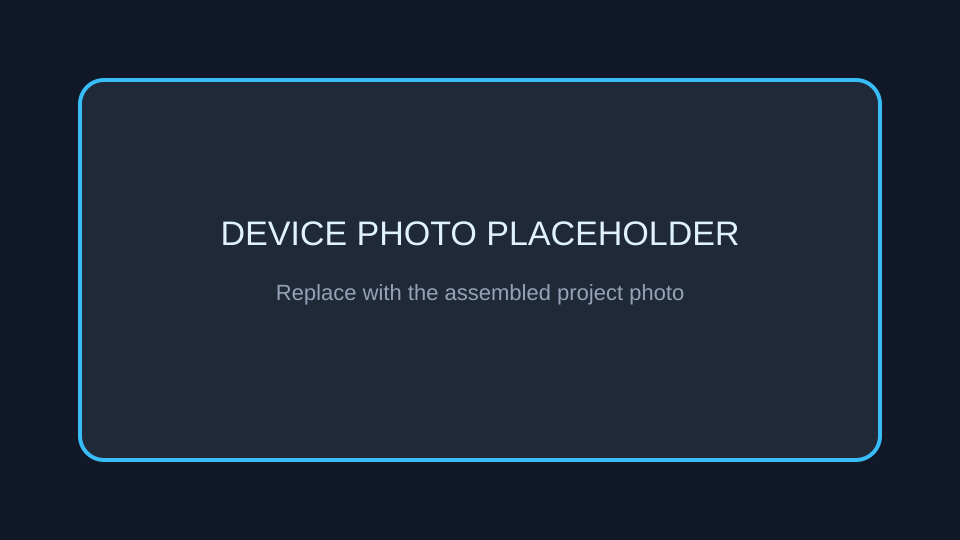
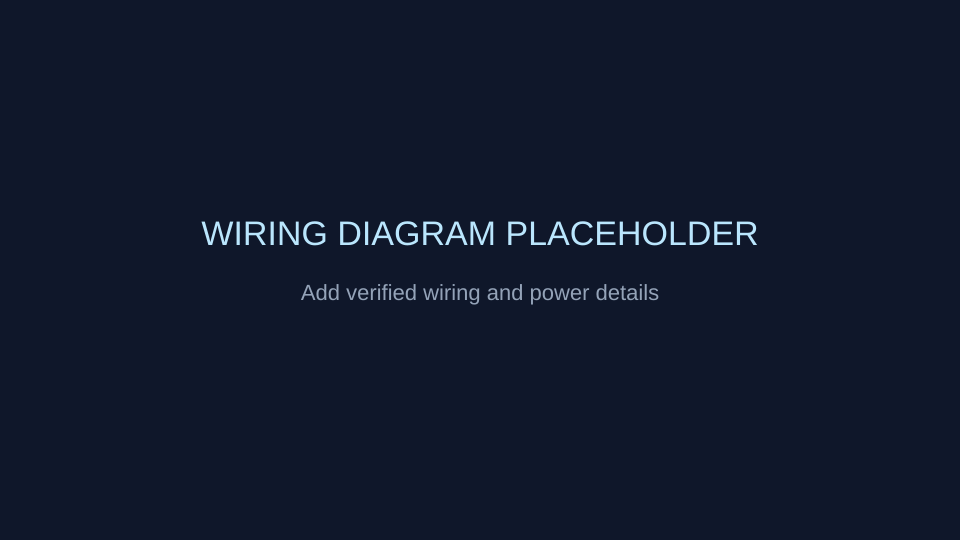

# Networking and Ethernet

Network-connected ESPHome examples combining MQTT with Ethernet, DHT11 and
TTGO TFT hardware.

## Configurations

| File | Board | Function |
|---|---|---|
| `esp32-dht-ethernet.yaml` | ESP32-C3 DevKitM-1 | Ethernet controller and DHT11 |
| `lightcheck_tft_mqtt_work.yaml` | ESP32 DevKit | TTGO T-Display and MQTT light check |

## Pinout

| Interface | Pin | Purpose |
|---|---:|---|
| Ethernet SPI | GPIO21 | CLK |
| Ethernet SPI | GPIO10 | MOSI |
| Ethernet SPI | GPIO9 | MISO |
| Ethernet SPI | GPIO20 | CS |
| TTGO display | GPIO18 | CLK |
| TTGO display | GPIO19 | MOSI |
| TTGO display | GPIO5 | CS |
| TTGO display | GPIO16 | DC |
| TTGO display | GPIO23 | Reset |
| TTGO display | GPIO4 | Backlight |

## MQTT

The light-check configuration uses the `tele/lightcheck` topic prefix.
Broker credentials are loaded from local secrets.

## Replace these placeholders

- `images/device-placeholder.svg` - assembled networking node.
- `images/wiring-placeholder.svg` - Ethernet and display wiring.
- `images/pinout-placeholder.svg` - board-specific pinout.
