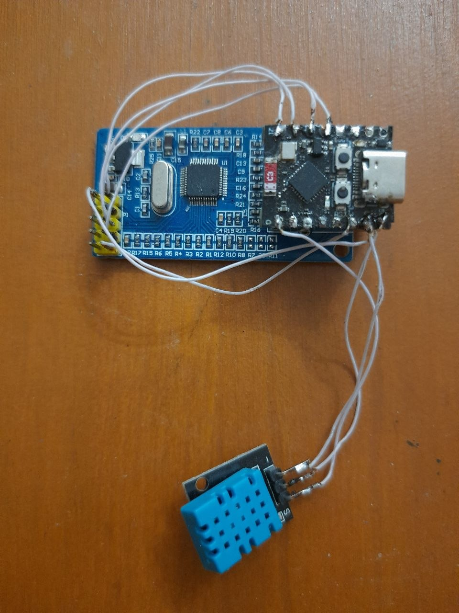

# Networking and Ethernet

Network-connected ESPHome examples combining MQTT with Ethernet, DHT11 and
TTGO TFT hardware.

Preview **ESP32-DHT-ETHERNET**

## Configurations

| File | Board | Function |
|---|---|---|
| `esp32-dht-ethernet.yaml` | ESP32-C3 DevKitM-1 | Ethernet controller and DHT11 |
| `lightcheck_tft_mqtt_work.yaml` | ESP32 DevKit | TTGO T-Display and MQTT light check |

## Pinouts

### `esp32-dht-ethernet.yaml`

ESP32-C3 DevKitM-1 with W5500 Ethernet and DHT11:

| Function | GPIO | Notes |
|---|---:|---|
| W5500 SPI CLK | GPIO21 | Ethernet clock |
| W5500 SPI MOSI | GPIO10 | Controller to W5500 |
| W5500 SPI MISO | GPIO9 | W5500 to controller |
| W5500 CS | GPIO20 | Chip select |
| DHT11 data | GPIO0 | Temperature and humidity |

### `lightcheck_tft_mqtt_work.yaml`

ESP32 DevKit with TTGO T-Display:

| Function | GPIO | Notes |
|---|---:|---|
| TFT SPI CLK | GPIO18 | ST7789V clock |
| TFT SPI MOSI | GPIO19 | ST7789V data |
| TFT CS | GPIO5 | Chip select |
| TFT DC | GPIO16 | Data/command |
| TFT reset | GPIO23 | Display reset |
| TFT backlight | GPIO4 | PWM output |

## MQTT

The light-check configuration uses the `tele/lightcheck` topic prefix.
Broker credentials are loaded from local secrets.

