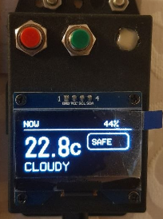

# Sensors and alerting

Sensor nodes and visual alert dashboards for ESP32 and ESP32-C3.

Preview **ESP ALERT**

Preview **WEATHER DISPLAY**

## Configurations

| File | Board | Function |
|---|---|---|
| `vibration_sensor.yaml` | ESP32-C3 DevKitM-1 | Vibration monitoring, SH1106 OLED |
| `vibration_sensor_hw483.yaml` | ESP32-C3 DevKitM-1 | HW483-oriented vibration variant |
| `esp-alert.yaml` | ESP32 DevKit | Alert dashboard with ILI9342 |
| `esphome_radar_cyd.yaml` | ESP32 DevKit/CYD | Radar and display dashboard |
| `weather_alert_display.yaml` | ESP32 DevKit | Weather alert display with SH1106 |

## Pinouts by configuration

### `vibration_sensor.yaml`

| Function | GPIO | Notes |
|---|---:|---|
| OLED I2C SDA | GPIO5 | SH1106 bus |
| OLED I2C SCL | GPIO6 | SH1106 bus |
| Vibration input | GPIO4 | Active input with pull-up |
| Status LED | GPIO8 | Configured output |

### `vibration_sensor_hw483.yaml`

| Function | GPIO | Notes |
|---|---:|---|
| OLED I2C SDA | GPIO5 | SH1106 bus |
| OLED I2C SCL | GPIO6 | SH1106 bus |
| Vibration input | GPIO4 | Active input with pull-up |
| Status LED | GPIO8 | Configured output |

### `esp-alert.yaml`

ESP32 DevKit/CYD with ILI9341 alert display:

| Function | GPIO | Notes |
|---|---:|---|
| Display SPI CLK | GPIO14 | ILI9341 clock |
| Display SPI MOSI | GPIO13 | ILI9341 data |
| Display SPI MISO | GPIO12 | ILI9341 response |
| Display CS | GPIO15 | Chip select |
| Display DC | GPIO2 | Data/command |
| Display backlight | GPIO21 | PWM output |

### `esphome_radar_cyd.yaml`

ESP32 DevKit/CYD with ILI9341 display and XPT2046 touch:

| Function | GPIO | Notes |
|---|---:|---|
| Display/touch SPI CLK | GPIO14 | Shared SPI clock |
| Display/touch SPI MOSI | GPIO13 | Shared SPI data |
| Display/touch SPI MISO | GPIO12 | Shared SPI response |
| Touch CS | GPIO33 | XPT2046 chip select |
| Touch interrupt | GPIO36 | Touch interrupt input |
| Display CS | GPIO15 | ILI9341 chip select |
| Display DC | GPIO2 | Data/command |
| Display backlight | GPIO21 | PWM output |

### `weather_alert_display.yaml`

ESP32 DevKit with ILI9342 display, buttons and status LED:

| Function | GPIO | Notes |
|---|---:|---|
| I2C SDA | GPIO21 | Weather sensor/display bus |
| I2C SCL | GPIO22 | Weather sensor/display bus |
| Status LED | GPIO5 | WS2812 output |
| Call button | GPIO4 | Active-low input |
| Time button | GPIO19 | Active-low input |
| Display SPI CLK | GPIO14 | ILI9342 clock |
| Display SPI MOSI | GPIO13 | ILI9342 data |
| Display SPI MISO | GPIO12 | ILI9342 response |
| Display CS | GPIO15 | Chip select |
| Display DC | GPIO2 | Data/command |
| Display backlight | GPIO21 | PWM output |

The OLED address used by the vibration configurations is `0x3C`.

## MQTT

Topic prefixes include `vibration_sensor`, `vibration_hw483` and `esp`.
Wi-Fi, MQTT and OTA secrets are never stored in these files.

