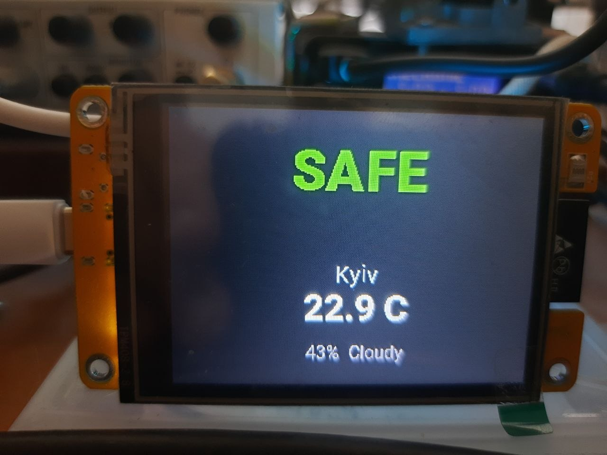

# Sensors and alerting

Sensor nodes and visual alert dashboards for ESP32 and ESP32-C3.

Preview esp-alert

## Configurations

| File | Board | Function |
|---|---|---|
| `vibration_sensor.yaml` | ESP32-C3 DevKitM-1 | Vibration monitoring, SH1106 OLED |
| `vibration_sensor_hw483.yaml` | ESP32-C3 DevKitM-1 | HW483-oriented vibration variant |
| `esp-alert.yaml` | ESP32 DevKit | Alert dashboard with ILI9342 |
| `esphome_radar_cyd.yaml` | ESP32 DevKit/CYD | Radar and display dashboard |
| `weather_alert_display.yaml` | ESP32 DevKit | Weather alert display with SH1106 |

## Pinout

| Interface | Pin | Purpose |
|---|---:|---|
| I2C sensors/displays | GPIO5 | SDA on ESP32-C3 vibration nodes |
| I2C sensors/displays | GPIO6 | SCL on ESP32-C3 vibration nodes |
| I2C weather display | GPIO21 | SDA |
| I2C weather display | GPIO22 | SCL |
| CYD SPI | GPIO14 | CLK |
| CYD SPI | GPIO13 | MOSI |
| CYD SPI | GPIO12 | MISO |
| CYD display | GPIO15 | CS |
| CYD display | GPIO2 | DC |

The OLED address used by the vibration configurations is `0x3C`.

## MQTT

Topic prefixes include `vibration_sensor`, `vibration_hw483` and `esp`.
Wi-Fi, MQTT and OTA secrets are never stored in these files.

